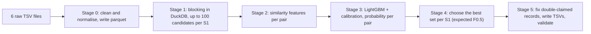

# Business Entity Resolution — Architecture & Decision Log

*ML Challenge 2026 · status as of 26 Sep 2026*

| | Value |
|---|---|
| Best validation score (macro F0.5) | **0.8872** (version v4) |
| Best leaderboard score | **0.74** (version v1, the only scored submission so far) |
| In progress | v5, a ranking change inside blocking |

This document is for anyone joining the team. Part 1 explains the problem and the pipeline in plain terms. Part 2 is the decision log: every engineering choice we made, why we made it, and what the numbers said. Part 3 covers how to run things and the traps we have already fallen into.

---

# Part 1 — What we are doing

## 1.1 The problem in one paragraph

We get business records from three independent sources. **Source 1 (S1)** is a clean reference list: every business appears once. **Sources 2 and 3 (S2, S3)** are messy. The same business can appear several times, with typos, abbreviations, reordered addresses, website-style names ("eastworks.com"), names written in Indian scripts, or a missing address. For every S1 business we must list which S2/S3 records are the same real business. Some S1 businesses have no match at all; these are called *singletons*.

## 1.2 How we are scored

The score is **F0.5 per S1 business, averaged over all S1 businesses** (macro average). F0.5 weights precision twice as much as recall, so a wrong match hurts more than a missed one. Singletons count fully: an empty list for a true singleton scores 1.0, and any match for it scores 0.0.

The practical consequences are simple. Be careful before adding a match, never ignore singletons, and remember that every S1 business is worth the same no matter how many matches it has.

## 1.3 The data at a glance

| File | Train rows | Test rows |
|---|---|---|
| Source 1 (reference) | 2,206,821 | 1,732,544 |
| Source 2 | 5,034,616 | 4,887,273 |
| Source 3 | 5,285,603 | 5,082,316 |

In the training answer key, 94.4% of S1 businesses have at least one match. The average is 3.46 matches, and the maximum is 11. The training data covers the **US and India**. The test set adds **France**, which never appears in training, so nothing may be hard-coded to US or India.

## 1.4 Why the pipeline has two stages

Comparing every test S1 record with every S2/S3 record would mean about 1.7M × 10M ≈ 17 trillion comparisons, which is impossible. So, like every serious entity-resolution system, we work in two stages:

1. **Blocking (candidate generation).** Cheap exact-match "keys", such as a rare word in the name or a house number plus street name, pull out a short list of plausible candidates for each S1 business (up to 100).
2. **Matching.** A machine-learning model scores each (S1, candidate) pair, and a decision rule picks the final list.

**Blocking sets a hard ceiling.** If a true match never becomes a candidate, the model can never pick it. We measure this ceiling directly: it's the score a perfect model would get on our candidates. Much of our progress so far has come from raising it.

## 1.5 The pipeline



**Stage 0 — Normalise.** This stage reads all six TSVs (24.2M rows, about 10 minutes) and writes cleaned parquet files to `work/`. It expands abbreviations, strips legal suffixes, handles DBA and website names, and splits addresses into words (`addr_tokens`), numbers (`addr_nums`) and a postcode. The notebook's §3.1 self-test checks this stage.

**Stage 1 — Blocking.** First it builds an index of all S2+S3 records (the "pool"), once. Then it runs several key-matching *schemes* for each batch of S1 records. Each scheme proposes candidates, the proposals are merged and ranked, and the top `top_k` per S1 are kept. This is the most engineered part of the system; see decisions D2–D11.

**Stage 2 — Features.** For every candidate pair it computes similarity features: name similarity (Jaro, partial ratio, token sets, rare-word coverage), address similarity, number overlap, blocking signals (which schemes found the pair, its rank), and features comparing a candidate with the other candidates for the same S1. The feature names carry prefixes: `n_` for name, `a_` for address, `b_` for blocking, `g_` for group.

**Stage 3 — Model.** A LightGBM classifier, followed by isotonic calibration so that the outputs behave like real probabilities. Stage 4 depends on that.

**Stage 4 — Set selection.** For each S1 it chooses how many of the top candidates to accept, maximising the *expected* F0.5, including the option "no matches".

**Stage 5 — Exclusivity and output.** An S2/S3 record belongs to one real business, so if two S1s claim the same record, the stronger claim wins. Then it writes `matching_results.tsv` and `candidate_pairs.tsv` and runs the official validator.

---

# Part 2 — Decision log

Each entry says what we decided, why, and what the evidence showed.

## D1 — Two stages: blocking, then a model

**What:** High-recall blocking produces candidates; a learned model makes the final call.

**Why:** Full pairwise comparison is impossible at this scale (§1.4). It also lets us measure the two halves separately: the blocking ceiling tells us how much is lost before the model sees anything, and the gap between the ceiling and the validation score tells us how much the model loses. Every later decision was chosen by looking at which of those two losses was bigger.

## D2 — DuckDB for blocking, with a disk-backed index and hard resource limits

**What:** All blocking runs as SQL in DuckDB. For the test run, the pool index is a database file on disk (`work/er_test.duckdb`). Every connection sets a memory limit, a temp-spill directory, and a **maximum spill size**. Before each large join, `estimate_pairs` computes the exact output size and aborts if it exceeds `pair_budget` (60M).

**Why:** The index tables are tens of millions of rows. In memory they would crowd out the joins for each batch; on disk they're read as needed. The spill cap makes a bad setting fail fast instead of silently filling the disk. The pre-flight estimate is exact: each key row fans out to `df` rows, so the join size is the sum of `df`. It costs milliseconds and prevents hour-long runaway joins.

## D3 — Block within country; keep features country-blind

**What:** Every blocking join requires the same `country` value on both sides, whatever that value is. Model features never use the country label.

**Why:** Matches don't cross countries, so this cuts useless comparisons. France only appears in test, so a model that learned US- or India-specific rules could fail there. Treating country as an open label satisfies the challenge rules and generalises to France automatically.

## D4 — The "rarest keys" principle

**What:** Each scheme keeps only each record's rarest few keys (`rare_per_s1`, `pair_tokens`, `g_tokens`, …) and drops keys shared by too many records (`max_token_df`, `addr_max_df`, `g_max_df`, …).

**Why:** A common word like "services" or "road" links a business to thousands of unrelated records; a rare word links it to a handful. The earlier notebook work measured this: raising the frequency ceilings to 5000 cost 8× the compute and found no extra matches. It even *lowered* recall at 30 candidates, because the extra noise pushed true matches out.

## D5 — The original blocking schemes (A–F)

These came with the first version of the notebook. Each targets a different kind of noise:

| Scheme | Key | Catches |
|---|---|---|
| A | Exact cleaned name (`name_key`), postcode agreement as tiebreak | Identical names |
| A2 | Name with spaces and web words (com, www, in…) removed | "eastworks.com" vs "East Works" |
| B | Rarest name words | One shared distinctive word |
| C | Consonant "skeleton" of name words (vowels dropped, sh→s, ph→f, c→k) | Typos and transliteration variants, which mostly change vowels |
| D | Same postcode + a shared name word | Short names in a known area |
| E | At least 2 shared rare address words | Different name, same address |
| F | Pairs of rare name words | Names where no single word is rare but the combination is |

Each scheme is capped at `scheme_cap=100` candidates per S1 *before* the merge. Scheme A had an extra fix: its cap used to keep an arbitrary subset of same-name records, which lost true matches for generic names, so postcode agreement now decides which ones stay.

## D6 — Merge and rank, then cut to `top_k`

**What:** All scheme outputs are merged per (S1, candidate). Each pair is flagged with the schemes that found it (`by_a` … `by_f`), ranked, and only the top `top_k` per S1 are kept. `candidate_pairs.tsv` is exactly this cut set.

**Why:** The model can only score a limited number of pairs per S1. The ranking decides which ones it sees. Ranking uses **IDF containment**: the share of the S1 name's "information" (rare words count more) that the candidate covers. The challenge also requires `candidate_pairs.tsv` to be exactly what the model scored, and this design guarantees it.

## D7 — `top_k` raised from 30 to 100 (v2)

**Evidence:** The first diagnosis showed blocking *found* 79.8% of true matches, but only 66.8% survived the top-30 cut. The cut alone was costing 13 points of recall. No S1 has more than 11 true matches, so 30 slots were enough in number; true matches were simply ranked too low.

**Result:** recall@100 was 0.766, the ceiling rose from 0.7926 to 0.8761, and validation rose from ~0.74 to 0.8160.

**Cost:** About 3× more candidate pairs, so the full test run grows from ~1 hour to roughly 2.5–3 hours.

## D8 — Scheme G: house number + street word (v3)

**Evidence:** We printed 25 random true matches that blocking missed. In about 22 of them the **address nearly matched** even though the name was unrecognisable: "74 Goodman Road" vs "74 GOODMAN ROAD", Indian names written in Devanagari/Telugu/Gujarati script, junk names like "Iriwexvera", and website names. Scheme E missed these because words like "goodman" are too common nationwide to pass its rarity filter. Combined with the house number, they're almost unique.

**What:** For each record, every number (up to 3 from `addr_nums`) is paired with each of its 4 rarest address words of 3+ letters, making keys like `74|goodman` and `30|dlf`. Settings: `g_tokens=4, g_per_s1=6, g_max_df=100, g_cap=20`. The number list comes from `GNUM_SQL`.

**A data quirk this handles:** 5-digit house numbers are read as US ZIP codes. "12800 Cherokee Court" ends up with `addr_nums=[]` and `postcode='12800'`. So G adds the postcode to the number list. Postcode + street word is a good key anyway.

**Why `g_cap=20`:** It stops G from taking more than 20 of the 100 slots when many businesses share one building.

**Result:** Matches found rose from 79.8% to **93.7%**. S1s with zero true candidates fell from 15.4% to 3.0%. The ceiling reached **0.9451**, and validation **0.8796**.

## D9 — Scheme H: rarest name word × rarest address word (v4)

**Evidence:** The first error analysis showed missed matches that G can't reach. Either the address has no number ("womens health | clovercrest cir olney md"), or both the name and address have typos ("corner sefgood | granite street medfield"). One name word plus one address word, like `womens|clovercrest` or `corner|medfield`, is still nearly unique.

**What:** Each record's 3 rarest name words (3+ letters, web words excluded) × 3 rarest address words → keys. Settings: `h_name_tokens=3, h_addr_tokens=3, h_per_s1=6, h_max_df=50, h_cap=20`.

**Result:** Matches found rose to **95.7%**, recall@100 to 0.907, the ceiling to **0.9542**, and validation to **0.8872**.

## D10 — G and H counted as "address evidence" (`by_e`)

**What:** In the merge, pairs from G and H set the same flag as scheme E (`by_e=1`) rather than adding new `by_g`/`by_h` columns.

**Why:** Nothing downstream (candidate file schema, feature code, model inputs) had to change, so we could test each scheme quickly.

**Trade-off:** The model can't tell which address scheme found a pair. Revisit this once the feature code is being changed anyway (see §2.3).

## D11 — Rank name + address agreement first (v5, running now)

**Evidence:** After H, recall jumped **7 points between rank 50 and rank 100**. The old ranking put *every* exact-name match first. For a common name like "corner seafood", dozens of same-name businesses in other cities filled the top ranks, and true matches found by address (G/H) landed at 50–100 or were cut.

**What:** In the merge's `ORDER BY`, `GREATEST(u.by_a, u.by_a2) DESC` became `GREATEST(u.by_a, u.by_a2) + u.by_e DESC`. Name *and* address agreement now ranks above name-only or address-only; within a tier, containment decides.

**How we'll judge it:** recall@100 should approach the 0.9566 found-at-all ceiling. If it drops instead, revert.

## D12 — Model: LightGBM + isotonic calibration, split by business

**What:** A LightGBM binary classifier with early stopping on average precision, followed by an isotonic calibrator (`work/lgbm.txt`, `work/calib.npz`). Train, calibration and validation are split **by S1 business**, not by pair. The v1 split was 30,627 / 6,642 / 6,677 businesses.

**Why:** Splitting by pair would leak, because pairs from the same business would sit on both sides. Calibration matters because Stage 4 treats scores as real probabilities. Pair-level quality is already very high (PR-AUC ≈ 0.99, ROC-AUC 0.999), which is why we are *not* tuning hyperparameters yet (D17).

## D13 — Expected-F0.5 set selection instead of one global threshold

**What:** For each S1, candidates are sorted by probability, and the code computes the expected F0.5 of accepting the top 1, 2, 3, … It also computes the probability that the business has **no** matches, as the product of (1 − p) over all candidates. It picks whichever is best. The expected true count uses *all* candidates, including those below `PROB_FLOOR=0.01` that aren't stored.

**Why:** The number of true matches varies from 0 to 11, and one cutoff can't fit all of them. This is consistently better than the best global threshold (+0.003 on validation), and it gives singletons a principled "empty" decision.

## D14 — Exclusivity repair

**What:** Each S2/S3 record belongs to at most one real business. If several S1s claim it, the conflict is resolved in favour of the strongest claim.

**Why:** It removes wrong matches between look-alike businesses. In the v1 test run, **60,571** contested records were resolved.

**Caveat:** It does nothing on validation (`0 contested`), because validation only contains a 2% sample of S1, so the competing S1 is almost never in the sample. Validation therefore *understates* how well we handle same-name duplicates. That's one reason some "wrong match" errors in the analysis may not occur on the real test.

## D15 — Develop on a 2% sample; submit rarely

**What:** The notebook's §1–§9 is our development loop. It runs blocking, features and training on a 2% sample of training S1 (`s1_sample=20` per mille, about 44k businesses) and grades itself on held-out businesses. The full test run (`run_submission.py`) is only started when validation clearly improves.

**Why:** A dev loop takes ~35 minutes and costs nothing. A full run takes 1–3 hours and costs one of 5 daily submissions. Validation has proven to be a reliable predictor: v1 scored ≈0.74 on validation and 0.74 on the leaderboard. The team's current target is to push validation much higher (toward 0.98) before spending the next submission.

## D16 — Resource settings for the 30 GB machine

**Settings:** `threads=4, mem_gb=18, spill_gb=40`, and the full run uses **32 shards** (`python run_submission.py 32`).

**History:**
- The setup guide suggested 8 shards.
- At 16 shards, DuckDB hit its 16.7 GB cap on the first batch (out of memory).
- Running test inference *inside the notebook* froze JupyterLab (81% RAM) and required a space restart.
- Lowering threads (less parallel memory) and 32 shards fixed it. `mem_gb` stays at about 60% of RAM to leave room for Python.

## D17 — No hyperparameter tuning yet

**Why:** Pairwise PR-AUC is already about 0.99, so tuning typically adds a few thousandths. The remaining loss is structural: missed candidates, variant names, empty addresses, duplicates. On a 6.7k-business validation set, a broad search would also partly fit noise. Tuning is the last step, not the next one.

## D18 — Move data through S3 and verify every transfer

**What happened:** The first dataset was uploaded through the JupyterLab browser and every file was silently **truncated**. The giveaway was that each file size was an exact multiple of 1 MiB. The pipeline ran happily on half the data, and the portal rejected two submissions with "569,804 S1 IDs missing".

**Rule since then:** Large files go through the S3 console or `aws s3 cp`. Zips are checked with `unzip -t` (it must say "No errors detected"), and byte sizes are compared on both ends. The correct sizes are listed in §3.4.

## 2.1 Results by version

| Version | Change | Found at all | Kept after cut | Ceiling | Validation | Leaderboard |
|---|---|---|---|---|---|---|
| v0 | Truncated data (by accident) | — | — | — | — | Rejected ×2 |
| v1 | Baseline, `top_k=30` | 0.798 | 0.668 | 0.7926 | ≈0.74 | **0.74** |
| v2 | `top_k=100` | 0.798 | 0.766 | 0.8761 | 0.8160 | — |
| v3 | + Scheme G | 0.937 | 0.889 | 0.9451 | 0.8796 | — |
| v4 | + Scheme H | 0.957 | 0.907 | 0.9542 | **0.8872** | — |
| v5 | Ranking tier (D11) | running | | | | |

"Found at all" is the share of true pairs any scheme generates. "Kept after cut" is the share within the top-k (recall@k).

## 2.2 Where the score is lost now (v4 error analysis)

| Category | S1 businesses | Score lost |
|---|---|---|
| Correct but incomplete | 2,291 | 0.0454 |
| Blocking found none | 153 | 0.0229 |
| Has wrong match(es) | 474 | 0.0211 |
| Singleton given a match | 110 | 0.0165 |
| Model predicted nothing | 46 | 0.0069 |

Missed true pairs split about evenly: 2,160 never reached the model and 2,225 were scored but not chosen. There were 648 wrong pairs chosen. India scores 0.877, the US 0.894.

The patterns behind these numbers:

- **Empty addresses.** True matches with no address get near-zero probability ("zinet |" p=0.07). Same-name records with no address are wrongly given to singletons. With no address, the only real evidence is whether the name is unique among all S1 businesses, and the model has no feature for that yet.
- **Look-alike characters.** "east w0rks", "indrita 6lobal", "High1and": digits stand in for letters. With an empty address these are never found.
- **Descriptor swaps and junk names.** "zinet services", "pune partners" and "tavonovi" (a random name at the same address) are sometimes true matches and sometimes different businesses.
- **Nearby-city variation.** True matches sometimes change the city (Woodfin/Asheville, Somers/Kenosha).
- **Unfixable noise.** Some wrong picks have the identical name *and* address as the true matches ("crystal international school"). No system can separate these, which is why top teams sit near 0.99 rather than 1.0.

## 2.3 Planned next steps, in order

1. **Finish v5** (D11): keep it if recall@100 and validation improve, revert otherwise.
2. **Look-alike character cleanup in names:** 0→o, 1→l, 3→e, 4→a, 5→s, 6→g, 8→b. It should only apply inside words that mix letters and digits, so real numeric names like "3068 lexington lane" are left alone. This targets the empty-address misses in §2.2.
3. **"How many S1 businesses share this name" feature,** computed over *all* S1, not the 2% sample. It helps the empty-address and duplicate-name decisions.
4. **More training data:** raise `s1_sample` from 20 to 50 (about 2.5× the dev loop time).
5. **Separate flags for schemes G and H** instead of reusing `by_e` (D10).
6. **Hyperparameter tuning, last** (D17).
7. **Full test run and submission** once validation justifies it (runbook in §3.3).

---

# Part 3 — How to run it, and known traps

## 3.1 Where it runs

The project runs in a SageMaker Studio **JupyterLab space** in ap-southeast-2: 8 vCPUs, 30 GB RAM, a 100 GB volume. Stopping the space keeps all files in `/home/sagemaker-user`. **Deleting** the space wipes them. Cost so far has been a few dollars.

After **every space restart**, the Python packages have to be reinstalled, because only the home folder survives:

```bash
pip install -q duckdb rapidfuzz lightgbm pyarrow indic-transliteration
```

## 3.2 Development loop (notebook)

1. Edit the notebook (`entity_resolution_pipeline.ipynb`) and save it.
2. Kernel → Restart Kernel.
3. Click the **first code cell of §10**, then Run → **Run All Above Selected Cell**. This runs §1–§9.
4. Read three outputs:
   - §5.4: the `RECALL@K` block and the `CEILING` line.
   - §9: `VAL MACRO F_0.5`.
   - The error-analysis cell below §9.
5. Shut down the kernel before any terminal run (it holds ~13 GB).

**Never use "Run All".** The §10 cell ends with live `run_test()` and `assemble()` calls, which start the multi-hour test inference inside the notebook. That is what froze JupyterLab.

## 3.3 Full test run (terminal)

```bash
cd ~/SageMaker
# 1. Remove the previous run's shard results, or the script will reuse them
rm -f work/test_probs_sh*.parquet work/test_sums_sh*.parquet work/test_candidates_sh*.parquet
# 2. Paths (needed in every new terminal)
export ER_DATA_DIR=/home/sagemaker-user/SageMaker/dataset
export ER_WORK_DIR=/home/sagemaker-user/SageMaker/work
# 3. Start in the background; survives closing the browser
nohup python run_submission.py 32 > submission.log 2>&1 &
# 4. Progress
grep "^--- shard" submission.log | tail -1
tail -15 submission.log          # finished when it prints "PASS in NN min"
```

The first log lines must say `skipping 0 already done`. Any other number means old shard files were reused. The run is resumable: if it dies, rerun the same command.

Then validate with the ID check, and copy the output out through S3:

```bash
python3 utils/validate_submission.py --matching output/matching_results.tsv \
  --candidate output/candidate_pairs.tsv --test-dir dataset/test --check-ids
aws s3 cp output/ s3://sagemaker-ap-southeast-2-863754632081/output/ --recursive
ls -l output/    # compare byte sizes after downloading from the S3 console
```

Upload only `matching_results.tsv` to the portal.

## 3.4 Reference byte sizes of the correct dataset

| File | Bytes |
|---|---|
| train_source1.tsv | 210,069,713 |
| train_source2.tsv | 489,301,488 |
| train_source3.tsv | 503,705,637 |
| train_ground_truth.tsv | 127,015,583 |
| test_source1.tsv | 175,022,086 |
| test_source2.tsv | 509,456,422 |
| test_source3.tsv | 506,002,772 |

The full `student_resource.zip` (1,094,824,289 bytes) is kept in the `sagemaker-ap-southeast-2-863754632081` bucket.

## 3.5 Files

| Path | What it is |
|---|---|
| `entity_resolution_pipeline.ipynb` | The working notebook: the whole pipeline. `run_submission.py` also reads its code. |
| `entity_resolution_pipeline_v1_074.ipynb` | Frozen backup of the version that scored 0.74. Don't edit. |
| `run_submission.py` | Terminal runner for the full test inference. |
| `work/` | Parquet files, DuckDB index, model (`lgbm.txt`, `calib.npz`), shard results. Backups `lgbm_v1.txt` and `calib_v1.npz` belong to v1. |
| `output/` | The two submission TSVs. |
| `utils/validate_submission.py` | Official validator. |
| `student_resource/` | Unzipped challenge kit, including `Documentation_template.md`. |

## 3.6 Known quirks and loose ends

- **`run_submission.py` line 27** was edited to read the notebook from the project root instead of `src/`. The final submission zip needs the code under `code/business_entity_resolution/src/`, so undo this when packaging.
- **The error-analysis cell** under §9 is a diagnostic only. Remove it before packaging.
- **`CONFIG['test_shards']` says 8**, but we pass 32 on the command line, which is what the run actually uses. The "this laptop has ~6GB" comment in `CONFIG` is out of date.
- **French abbreviation rules leak into other countries.** In an Indian address, "R K Pet" became `rue k pet`, because single-letter "R" was expanded to the French "rue". Both sides get the same treatment, so matching isn't hurt today, but it should be scoped to France.
- **5-digit house numbers are parsed as US ZIP codes** (D8). Scheme G works around this; the normaliser itself is unchanged.
- **The `fetch_record_batch` deprecation warning** in the features stage is harmless.

## 3.7 Challenge rules that shape our design

- **No external data or lookups.** No geocoding, business registries, or web data. Everything we use comes from the provided files. `indic-transliteration` is a local, rule-based script converter, not a lookup service.
- **`candidate_pairs.tsv` must be exactly the set the model scored.** Our top-k cut guarantees this (D6).
- **Any model must be MIT/Apache licensed and at most 8B parameters.** LightGBM is MIT.
- **The final ranking uses the private leaderboard**, a different part of the test set from the public one. Trust validation over small public-leaderboard swings.
- **Final zip layout:** `output/` (both TSVs), `code/business_entity_resolution/` (`src/`, `README.md`, pinned `requirements.txt`), and the filled-in `Documentation_template.md`. This document is a good starting point for that write-up.