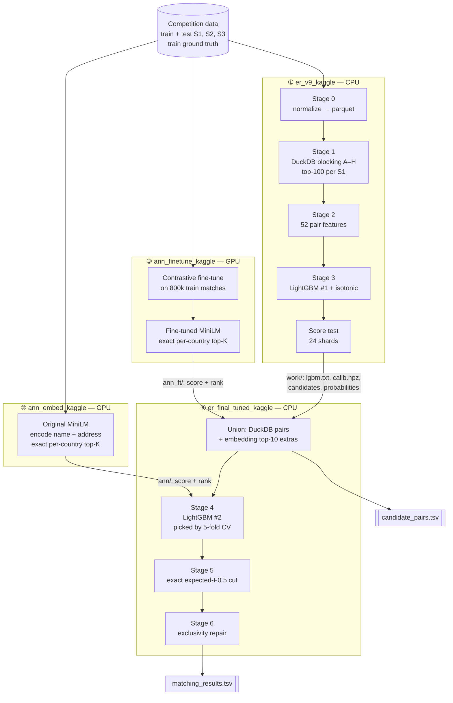
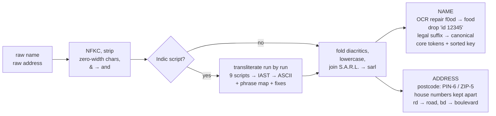
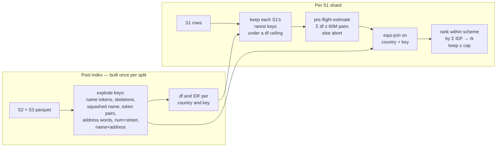
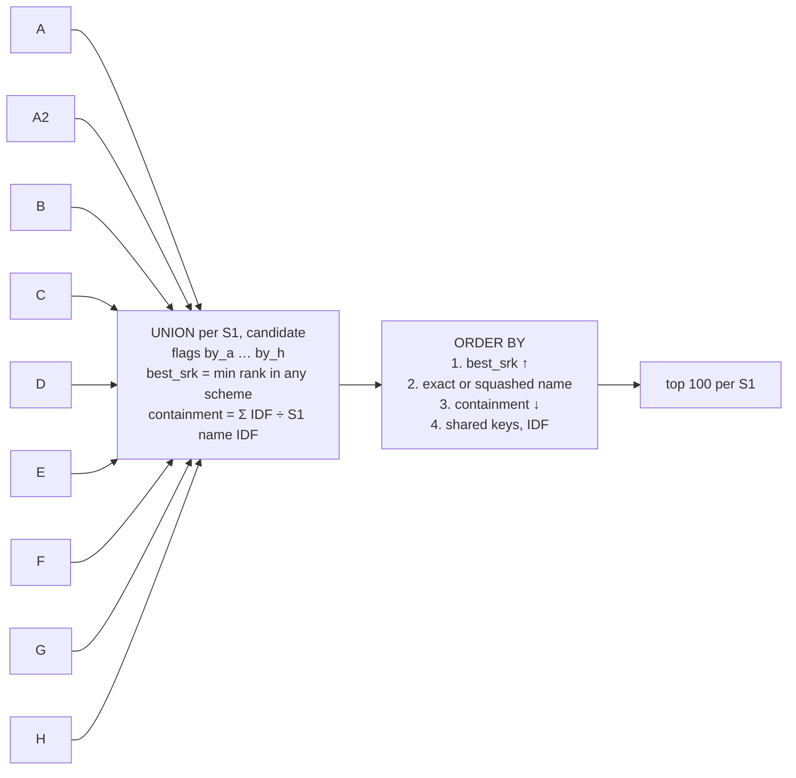
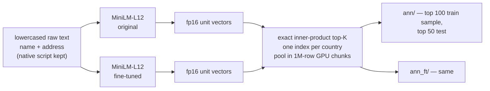
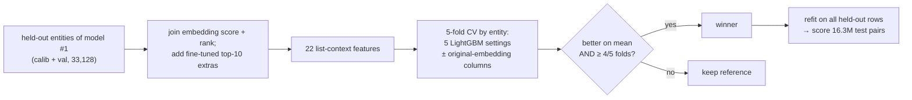
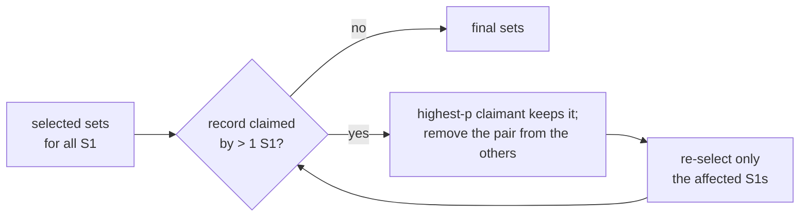

# Amazon ML Challenge 2026: Business Entity Resolution

**Team Rookies:** Swaraj, Subhajit, Tanmay, Abhishek

For every business in a clean reference list (**S1**), find all records in two noisy sources
(**S2**, **S3**) that describe the same real-world business. The data has typos,
abbreviations, garbled transliterations from nine Indian scripts, OCR noise, website-style
names, missing addresses, and a country that appears only in test (France).

**Result:** 5-fold cross-validated macro F0.5 of **0.9431** on 33,128 held-out training
entities, up from 0.74 for our first leaderboard submission.

### Contents
1. [The problem in numbers](#1-the-problem-in-numbers)
2. [End-to-end data flow](#2-end-to-end-data-flow)
3. [Stage 0: normalization](#3-stage-0-normalization)
4. [Stage 1: blocking (candidate generation)](#4-stage-1-blocking-candidate-generation)
5. [Embedding retrieval](#5-embedding-retrieval)
6. [Stages 2–3: pair features and the first model](#6-stages-23-pair-features-and-the-first-model)
7. [Stage 4: the second-stage model](#7-stage-4-the-second-stage-model)
8. [Stages 5–6: choosing the match set](#8-stages-56-choosing-the-match-set)
9. [Validation protocol](#9-validation-protocol)
10. [Results](#10-results)
11. [What did not work](#11-what-did-not-work)
12. [Repository layout and notebook responsibilities](#12-repository-layout-and-notebook-responsibilities)
13. [Reproduce](#13-reproduce)
14. [Compliance](#14-compliance)

---

## 1. The problem in numbers

| | Train | Test |
|---|---|---|
| S1 (reference) | 2,206,821 (US, India) | 1,732,544 (India, US, **France**) |
| S2 + S3 (pool) | 10,320,219 | 9,969,589 |

**Metric.** For one S1 entity with k predicted, m true and h correct matches:
`F0.5 = 1.25·h / (k + 0.25·m)`. An empty prediction for a true singleton scores 1, and any
prediction for a singleton scores 0. The final score is the average over all S1 entities.

Five facts from the data shaped the design:

| Fact | Design consequence |
|---|---|
| 2.2M × 10.3M ≈ 2×10¹³ possible pairs | We need **blocking**, and its recall caps the score: an entity whose matches are never proposed scores 0. |
| Each S2/S3 record belongs to **at most one** S1 (all 7.64M matched ids are unique) | It is an assignment problem, so we enforce **one owner per record**. |
| Precision counts twice as much as recall, and 5.6% of entities are singletons | Set size is decided **per entity**, and "no match" must be a real option. |
| Nine Indic scripts, `grin lajistiks` = green logistics, OCR `5hakti`, `f0od` | Transliteration, digit repair, **sound-alike keys** and a **learned similarity** that reads native scripts. |
| France has no labels at all | Everything is computed **per country**, and nothing is hard-coded to US or India. |

---

## 2. End-to-end data flow

The pipeline is four Kaggle notebooks. Each one hands its output to the next as a Kaggle
dataset.



Notebooks ② and ③ read only the raw data, so they run in parallel with ①. Notebook ④ needs
all three.

---

## 3. Stage 0: normalization

`er/normalize.py` turns each raw row into join-ready parts and writes one parquet file per
source. A worker pool handles 200k-row chunks.



| Output column | Example (`राम मार्केटिंग प्राइवेट लिमिटेड`) |
|---|---|
| `name_tokens` (core) | `[ram, marketing]` |
| `name_suffix` | `pvt ltd` |
| `name_key` | `marketing ram`, which equals the key of "Ram Marketing Private Limited" |

Safeguards:
- A **self-test** raises before Stage 0 runs if any of the nine scripts transliterates to an empty name. A missing transliteration package once deleted 8 of 9 scripts silently.
- Row counts are checked against the published sizes.
- The parquet cache is stamped with `NORM_VERSION`, so a normalizer change always forces a rebuild.

---

## 4. Stage 1: blocking (candidate generation)

Blocking sets the ceiling of the whole system, so it received most of our effort.

### 4.1 How a blocking scheme works

For each split we build a **pool index** in DuckDB once. For each key type it holds every
pool record's keys, plus each key's document frequency (df) and IDF = ln(1 + N/df),
**per country**. Each S1 entity then joins the index using only its **rarest** keys. This
keeps common words (`delhi`, `services`, `traders`) from exploding the join, without leaving
any entity with no keys at all.



### 4.2 The nine schemes

| Scheme | Join key (always within one country) | S1 keys used | Cap / S1 | Miss pattern it rescues |
|---|---|---|---|---|
| **A** exact name | sorted core tokens (`name_key`) | the key | 300 | word order, suffix variants: `Traders Acme Pvt Ltd` = `Acme Traders Private Limited` |
| **A2** squashed | core tokens without web tokens, concatenated | length ≥ 4 | 300 | `acme.com` = `acme`, `blue pub` = `bluepub` |
| **B** rare token | one name token | the 3 rarest, df ≤ 1000 | 100 | partial names, extra or missing words |
| **C** skeleton | token with `sh→s ph→f c→k`, vowels removed | the 3 rarest, df ≤ 1000 | 100 | vowel and spelling noise: `lajpat` = `lajpet` → `ljpt`; `shakti` = `sakti` → `skt` |
| **D** postcode + name | (postcode, name token) | all, when a postcode exists | — | same-place records with partial names |
| **E** address words | address word, **≥ 2 shared** | the 4 rarest, df ≤ 300 | 100 | rebrands at the same address |
| **F** token pairs | `tokA\|tokB` over the 4 rarest name tokens | the 6 rarest pairs, df ≤ 2000 | 100 | names made of common words: `sai traders` |
| **G** number + street | `house no.\|street word` (≤ 3 numbers + postcode) × the 4 rarest words | the 6 rarest, df ≤ 100 | 20 | name garbled beyond recognition, same address |
| **H** name × address | `name word\|address word`, 3 × 3 rarest | the 6 rarest, df ≤ 50 | 20 | each word common alone, rare together |

Each scheme was added to fix a pattern we saw in `inspect_misses`, which prints true pairs that
blocking failed to propose. G and H came from misses that shared 3–4 address words, each too
common for scheme E. A 5-digit US house number is often parsed as a ZIP code, so G treats the
postcode as a house number too.

### 4.3 The fair-slot union



Ordering by the **best rank within any scheme** gives each scheme fair slots: every scheme's
#1 comes first, then every scheme's #2, and so on. Before this, one global score let broad
scheme B fill the list and push out the few precise G and H hits. With the same schemes,
validation F0.5 went from 0.887 to **0.917**.

### 4.4 Measured recall (training sample against the full pool)

| Version | Change | Generation (uncapped) | Recall at cut | Ceiling F0.5 |
|---|---|---|---|---|
| v1 | A–F, top-30 | 0.798 | 0.668 | 0.793 |
| v2 | top-100 | 0.798 | 0.766 | 0.876 |
| v3 | + G | 0.937 | 0.889 | 0.945 |
| v4 | + H | 0.957 | 0.907 | 0.954 |
| final | + embedding top-10 extras | — | **+4.3% true pairs** in the scored set (108,919 → 113,651 on held-out entities) | — |

"Ceiling" is the macro F0.5 of a perfect classifier restricted to the candidates.

### 4.5 Scale and engineering

- **Test volume.** Blocking reduces ≈ 1.7×10¹³ possible test pairs to **155,956,535** candidates (90 per S1).
- **One index, many shards.** The test S1 file is split into 24 hash shards. The pool index is built once in a file-backed DuckDB, and each finished shard is skipped on rerun.
- **Capped resources.** DuckDB uses 4 threads, a 14 GB memory limit and 8 GB of spill. The pre-flight pair estimate aborts a join before it can fill the disk.
- **Full-pool training sample.** The 5% training sample is blocked against the **full** train pool in 2% slices. A smaller pool would inflate recall and hide rivals.

---

## 5. Embedding retrieval

Some matches share no token, skeleton or address word with their S1 record, for example
`vijaya siva kansaltansi` and `vijay shiv consultancy`. For these we added dense retrieval,
which acts as a tenth blocking scheme.



- **Encoder:** `paraphrase-multilingual-MiniLM-L12-v2` (Apache-2.0, 118M params). It reads Devanagari and other scripts natively, so it gets the **raw** text rather than the transliteration.
- **Fine-tuning** (notebook ③):
  - 800k pairs of (S1 text, one random true S2/S3 text);
  - symmetric in-batch contrastive loss with scale 20;
  - batch 256, lr 3e-5 with warm-up and linear decay, fp16.
  - Every batch is **single-country**, so the other 255 records in it are hard negatives from the same market.
  - The validation sample is **excluded**, and recall@1/@10 is checked on it before and after.
- **Search:** exact (no approximate index) and per country, so cross-country matches are impossible by construction.
- **How it enters the pipeline:**
  - The fine-tuned encoder's **top-10 records that DuckDB did not propose** join the candidate set (`in_duck = 0`).
  - Both encoders' scores and ranks become stage-2 features.
  - On held-out entities this adds 147,938 rows, and 4,732 of them are true matches that blocking had missed.

---

## 6. Stages 2–3: pair features and the first model

**52 features per pair.** Set features are computed in DuckDB and string scores with
`rapidfuzz.process.cpdist` across all cores. A slow row-by-row reference implementation must
agree with the fast one on a random sample, or the run stops.

| Group | # | Features |
|---|---|---|
| Name | 19 | token-set/sort/partial ratio, Jaro-Winkler, prefix ratio, Jaccard, IDF coverage from both sides, length ratio, token-count gap, exact key, suffix agree/conflict, **sound-alike skeleton** Jaccard/ratio, count and max IDF of **leftover words** (no exact or sound-alike counterpart) on each side |
| Address | 7 | token-set ratio, Jaccard, postcode match, both have a postcode, house-number overlap, both have numbers, either empty |
| Blocking provenance | 14 | which of 9 schemes fired, number of schemes, IDF score, shared keys, containment, union rank |
| Group | 5 | candidates per S1, rank fraction, ratio and margin to the entity's best, is-top |
| **Rival S1** | 5 | S1 entities sharing this name (each side); best address fit of a **different** S1 with the candidate's name; this pair's advantage over it; rival shares a house number |
| Context | 2 | source (S2 or S3), same country |

The rival features are computed over the **full** S1 file. They catch the commonest wrong
merge: a chain's branch record that has the right name but belongs to the S1 entity at the
other address.

**LightGBM #1:**
- Settings: 63 leaves, `min_data_in_leaf` 100, learning rate 0.05, ≤ 600 rounds with early stopping on average precision, `deterministic=True`.
- Data: a 5% entity-hash sample of train, about 110k entities, split by entity into 70% train, 15% **isotonic calibration** and 15% validation.
- Pair-level validation: ROC-AUC ≈ 0.999, PR-AUC ≈ 0.99.
- On test, each shard keeps the pairs with p₁ ≥ 0.01, plus E[m] = Σp₁ over all of an entity's candidates.

---

## 7. Stage 4: the second-stage model

The first model scores each pair on its own. The second model sees the **whole candidate list**
of the entity, plus the embedding evidence.



- **Features (22):**
  - from p₁ across the list: p₁, rank, list size, E[m] = Σp₁, max, second best, p₁ ÷ max, gaps to the top/previous/next candidate, cumulative and remaining mass, count above 0.5, logit;
  - from the fine-tuned embedding: cosine, rank, gap to the best neighbour, best neighbour score, found-by-DuckDB flag;
  - from the original embedding: cosine, rank, gap.
- **Honest inputs:** it is trained only on entities that model #1 never trained on, so p₁ is a genuine out-of-sample probability.
- **Winner:** 7 leaves, 800 trees, with the original-embedding columns. It scored **0.9431**, better than the reference in all 5 folds (table in [Results](#10-results)).

---

## 8. Stages 5–6: choosing the match set

### 8.1 Exact expected-F0.5 cut

We do not use a probability threshold. For each entity we sort its candidates by p and treat
them as independent coin flips. For each cut k, the number of hits among the top k (h) and the
number of true matches below the cut (r) each follow a Poisson-binomial distribution. We
compute both exactly by convolution:

```
E[F0.5(k)] = Σ_h Σ_r  P(h) · P(r) · 1.25·h / (k + 0.25·(h + r))        k = 1 … 30
E[F0.5(0)] = Π (1 − p_i)                                              predict nothing
```

The best k is kept. Two real outputs of this rule:

| Candidate probabilities | E[F0.5] for k = 0, 1, 2, 3, 4, 5 | Chosen | A 0.5 threshold would… |
|---|---|---|---|
| 0.97, 0.92, 0.55, 0.20, 0.05 | 0.001, 0.730, **0.883**, 0.824, 0.700, 0.588 | **k = 2** | take 3, a worse expected score |
| 0.30, 0.10, 0.05 | **0.598**, 0.293, 0.218, 0.170 | **k = 0** (singleton) | take 0, but any threshold below 0.30 takes 1 |

### 8.2 Exclusivity repair



The repair runs once, globally, over all of test, for at most 5 rounds. On test it resolved
**82,749** contested records, and the final file assigns **0** records to two owners.

---

## 9. Validation protocol

- **Never subsample the pool.** Only S1 is sampled (5% by `hash(entity_id)`), always against the full pool, because a smaller pool inflates recall.
- **Split by entity.** Folds are hashes of the S1 id, so they do not depend on file order. Model #1 uses 70 / 15 / 15, and calibration never touches train or val.
- **No leakage across stages.** The encoder fine-tune excludes the validation sample. Model #2 sees only model #1's out-of-sample entities.
- **Measure, then model.** Every blocking change reports generation recall, recall@K and the ceiling F0.5 before any retraining.
- **One change per experiment.** Changes that did not help were reverted and logged (§11).

---

## 10. Results

**Development history** (validation macro F0.5, one change per step):

```
0.74   v1  baseline, top-30            ██████████████████████████████████████░░░░░░░░░░░
0.816  v2  top-100 cut                 ██████████████████████████████████████████░░░░░░░
0.880  v3  + scheme G                  █████████████████████████████████████████████░░░░
0.887  v4  + scheme H                  █████████████████████████████████████████████░░░░
0.917  v6  fair-slot union             ███████████████████████████████████████████████░░
0.920  v7  + rival-S1 features         ███████████████████████████████████████████████░░
0.9416     + embeddings, 2nd stage     ████████████████████████████████████████████████░
0.9431     tuned 2nd stage (submitted) ████████████████████████████████████████████████░
```

Up to v7 the scores are on the 15% validation fold. The last two rows are 5-fold CV over
33,128 held-out entities.

**Second-stage selection (5-fold CV):**

| Setting | Macro F0.5 | vs reference | Per-fold gain |
|---|---|---|---|
| DuckDB + fine-tuned extras, 15 leaves / 300 trees (reference) | 0.9416 | — | — |
| … 31 leaves / 600 trees | 0.9419 | +0.0003 | −0.0000 +0.0010 −0.0003 −0.0008 +0.0018 |
| … 63 leaves / lr .03 / 1000 trees | 0.9415 | −0.0001 | −0.0006 +0.0010 −0.0003 −0.0018 +0.0011 |
| … 7 leaves / 800 trees | 0.9421 | +0.0005 | +0.0000 +0.0013 +0.0005 +0.0002 +0.0003 |
| … + original embedding, 15 leaves / 300 trees | 0.9428 | +0.0012 | +0.0012 +0.0018 +0.0014 +0.0004 +0.0009 |
| **… + original embedding, 7 leaves / 800 trees (submitted)** | **0.9431** | **+0.0015** | +0.0010 +0.0022 +0.0014 +0.0009 +0.0017 |

**Test predictions:**
- 1,732,544 rows; 4.9% empty (training truth: 5.6% singletons).
- Mean set size 3.34 (truth: 3.46); 5,780,761 matched pairs.
- 0 records with two owners.

**Where the score was lost** (error analysis before the embedding stage):

| Category | Score lost | Typical case |
|---|---|---|
| correct but incomplete | 0.035 | confident about 3–4 matches but not the 5th or 6th |
| wrong match included | 0.018 | same-name branch of a chain; generic name with no address |
| singleton given a match | 0.014 | near-duplicate name in the pool |
| blocking found nothing | 0.008 | garbled transliteration with no shared key |
| model predicted nothing | 0.005 | address-less, heavily abbreviated copies |

---

## 11. What did not work

| Attempt | Outcome |
|---|---|
| Sibling-support features (similarity to the entity's other candidates) | 0.920 → 0.917, removed: same-name siblings often belong to another S1 |
| Hand-weighted rank tier in the union (exact name first) | 0.882 vs 0.887, reverted in favour of fair slots |
| Deeper second-stage models (63 leaves, 1000 trees) | no gain: the second stage needs context, not capacity |

---

## 12. Repository layout and notebook responsibilities

### Submission package: `Rookies_submission/`

```
Rookies_submission/
├── Documentation_template.md        full methodology write-up (competition template)
└── code/business_entity_resolution/
    ├── README.md                    exact reproduction commands, env variables
    ├── requirements.txt             pinned versions
    └── src/
        ├── 01_main_pipeline.py      = notebook ①   (CPU)
        ├── 02_embed_original.py     = notebook ②   (GPU)
        ├── 03_embed_finetuned.py    = notebook ③   (GPU)
        ├── 04_final_selection.py    = notebook ④   (CPU)
        ├── er/
        │   ├── config.py      paths (env-overridable), CONFIG: every blocking cap and df ceiling
        │   ├── normalize.py   Stage 0 + self-test
        │   ├── blocking.py    pool index, schemes A–H, fair-slot union, recall diagnostics
        │   ├── features.py    52 pair features + slow reference + equivalence check
        │   ├── model.py       LightGBM #1, isotonic calibration, validation report
        │   ├── select.py      first-stage set selection and exclusivity repair
        │   ├── submit.py      sharded resumable test run, validator call
        │   ├── dense.py       encoder, exact per-country search, contrastive fine-tune
        │   ├── stage2.py      LightGBM #2, exact expected-F0.5 cut, fast repair
        │   └── metric.py      F0.5, macro F0.5
        └── notebooks/               the four Kaggle notebooks exactly as run
```

The output TSVs (2 GB) are not on GitHub. They ship in the submission zip.

### Notebooks in the repository root

**Final pipeline.** These were run on Kaggle in this order:

| Notebook | Hardware | Responsibility | Hands over |
|---|---|---|---|
| ① `er_v9_kaggle.ipynb` | CPU | Stage 0 with self-test, **blocking A–H**, 52 features (with equivalence check), LightGBM #1 + calibration, validation report, error analysis, 24-shard test scoring | `work/` |
| ② `ann_embed_kaggle.ipynb` | GPU T4 ×2 | original-MiniLM encoding, exact per-country search, recall gate vs DuckDB | `ann/` |
| ③ `ann_finetune_kaggle.ipynb` | GPU T4 ×2 | contrastive fine-tune, before/after recall check, re-encoding and search | `ann_ft/` |
| ④ `er_final_tuned_kaggle.ipynb` | CPU | candidate file, embedding extras, LightGBM #2 by 5-fold CV, exact F0.5 cut, exclusivity, both TSVs | submission |

**Development history.** These are kept for reference and are not needed to reproduce the submission:

| Notebook | What it was |
|---|---|
| `ml-v1.ipynb`, `entity_resolution_pipeline.ipynb` | v1 baseline: blocking A–F, top-30, first leaderboard submission (0.74) |
| `entity_resolution_pipeline-2.ipynb` | later iteration with the fair-slot union and rival-S1 features (v6–v7) |
| `er_finish_kaggle.ipynb` | first second-stage selector; embedding recall gate |
| `er_final_kaggle.ipynb` | compared DuckDB-only, embedding-rescored, **DuckDB + embedding extras (won)** and embedding-only |
| `code/business_entity_resolution/` | the early prototype (EDA, first blocking and features) |

---

## 13. Reproduce

```bash
cd Rookies_submission/code/business_entity_resolution
pip install -r requirements.txt
cd src
export ER_DATA_DIR=/path/to/dataset ER_RUN_DIR=/path/to/run
python 01_main_pipeline.py      # CPU, resumable
python 02_embed_original.py     # GPU
python 03_embed_finetuned.py    # GPU, independent of step 2
python 04_final_selection.py    # CPU → $ER_RUN_DIR/final/*.tsv
```

`python 01_main_pipeline.py --dev` runs the train split only and stops after the validation
report. `Rookies_submission/code/business_entity_resolution/README.md` covers the Kaggle
dataset wiring, environment variables, and the checks each step runs.

---

## 14. Compliance

- No external data, APIs or geocoding. The only vocabularies are short hand-written maps (legal suffixes, address abbreviations, a Devanagari phrase map).
- Models: LightGBM (MIT) and `paraphrase-multilingual-MiniLM-L12-v2` (Apache-2.0, 118M parameters), far below the 8B limit.
- The competition dataset is not part of this repository.
